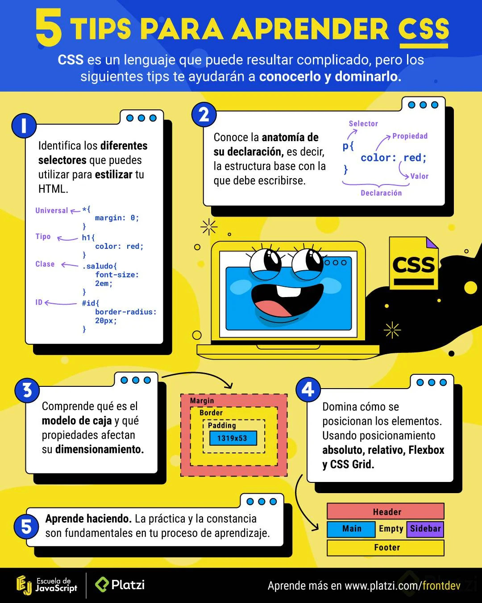
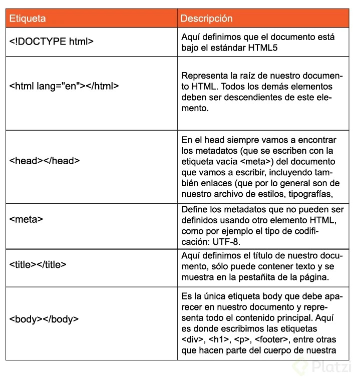
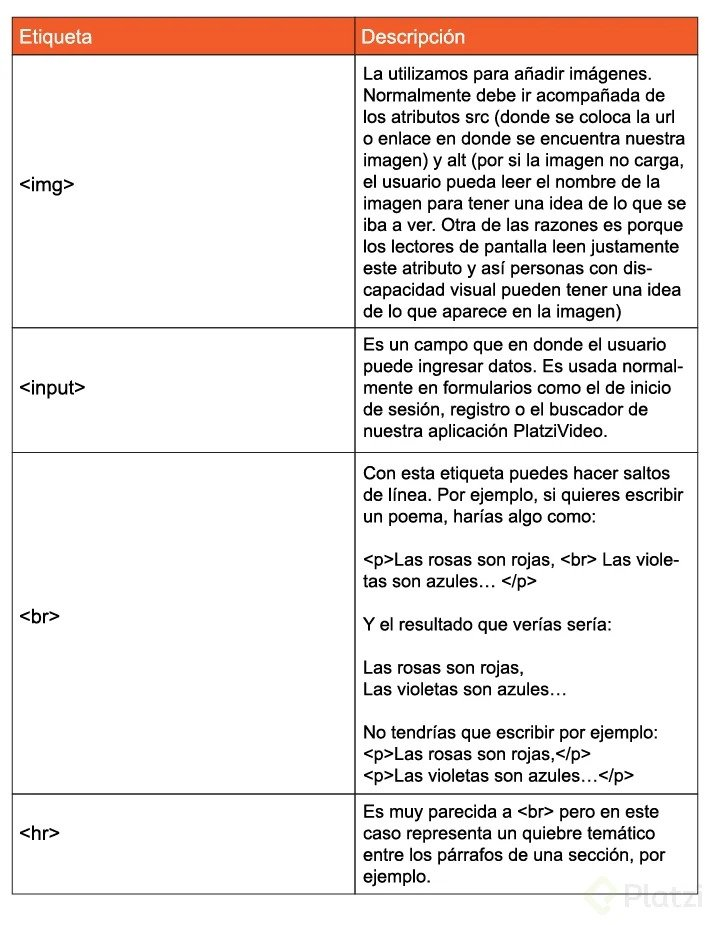
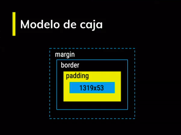
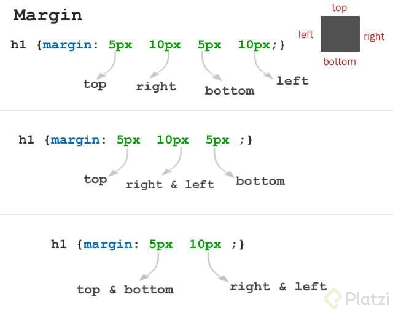
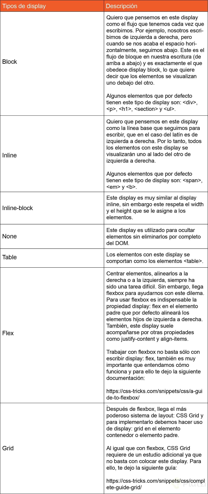
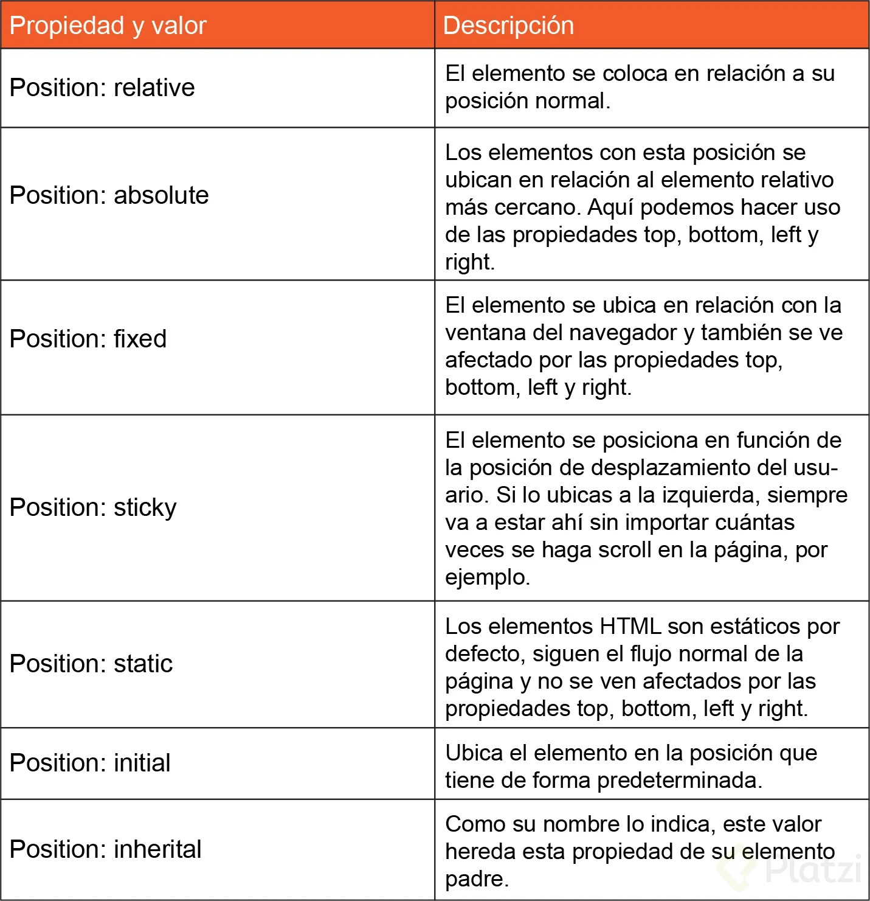

# Curso de Frontend Developer

## Tabla de Contenidos

- [Curso de Frontend Developer](#curso-de-frontend-developer)
  - [Tabla de Contenidos](#tabla-de-contenidos)
  - [DOM, CSSOM, Render Tree y el proceso de renderizado de la Web](#dom-cssom-render-tree-y-el-proceso-de-renderizado-de-la-web)
  - [5 tips para aprender CSS](#5-tips-para-aprender-css)
  - [Anatomía de un Elemento HTML: Atributos, Anidamiento y Elementos vacíos](#anatomía-de-un-elemento-html-atributos-anidamiento-y-elementos-vacíos)
  - [Funciones de las etiquetas HTML más importantes](#funciones-de-las-etiquetas-html-más-importantes)
  - [Anatomía de una declaración CSS: Selectores, Propiedades y Valores](#anatomía-de-una-declaración-css-selectores-propiedades-y-valores)
  - [Tipos de selectores, pseudo-clases y pseudo-elementos](#tipos-de-selectores-pseudo-clases-y-pseudo-elementos)
  - [Modelo de caja](#modelo-de-caja)
  - [Displays en CSS](#displays-en-css)
  - [Posicionamiento en CSS](#posicionamiento-en-css)

## DOM, CSSOM, Render Tree y el proceso de renderizado de la Web

- **DOM**: Document Object Model. Es una transformación del código HTML escrito por nosotros a objetos entendibles para el navegador.
- **CSSOM**: así como el DOM para el HTML, EL CSSOM es una representación de objetos de nuestros estilos en CSS.
- **Render Tree**: es la unión entre el DOM y el CSSOM para renderizar todo el código de nuestra página web.

Pasos que sigue el navegador para construir las páginas web:

1) Procesa el HTML para construir el DOM.
2) Procesa el CSS para construir el CSSOM.
3) El DOM se une con el CSSOM para crear el Render Tree.
4) Se aplican los estilos CSS en el Render Tree.
5) Se *pintan* los nodos en la pantalla para que los usuarios vean el contenido de la página web.

## 5 tips para aprender CSS



## Anatomía de un Elemento HTML: Atributos, Anidamiento y Elementos vacíos

Nuestros elementos HTML se componen de:

- **Etiqueta de apertura**: el nombre de nuestra etiqueta encerrado entre símbolos de mayor o menor. Por ejemplo: `<h1>`.
- **Contenido**: dentro de nuestras etiquetas podemos añadir texto u otros elementos HTML, lo que conocemos como anidamiento.
- **Etiqueta de cierre**: son casi iguales que las etiquetas de apertura, pero también necesitan un `slash (/)` antes del nombre de la etiqueta. Por ejemplo: `</h1>`.

Las etiquetas de apertura también pueden tener atributos. Los atributos nos permiten definir características especiales para nuestros elementos:

```html
<etiqueta "atributo"="valor del atributo">
<h1>Este es un título</h1>
```

También existen elementos vacíos. Estos elementos no tienen contenido ni etiqueta de cierre, solo etiqueta de apertura y atributos. Por ejemplo:

```html

```

## Funciones de las etiquetas HTML más importantes

Al escribir en nuestro editor de código `html:5` vemos que nos aparece la siguiente estructura:

```html
<html lang="en">
<head>
  <meta charset="UTF-8">
  <meta name="viewport" content="width=device-width, initial-scale=1.0">
  <meta http-equiv="X-UA-Compatible" content="ie=edge">
  <title>Document</title>
</head>
<body>
  
</body>
</html>
```

Veamos la descripción de estos elementos:



Si por ejemplo, queremos añadir en nuestro documento estilos o JavaScript, lo hacemos con las etiquetas `<style>` y `<script>` respectivamente, que a su vez deben ir dentro de la etiqueta raíz `<html>`, algo así:

```html
<html lang="en">
<head>
  <meta charset="UTF-8">
  <meta name="viewport" content="width=device-width, initial-scale=1.0">
  <meta http-equiv="X-UA-Compatible" content="ie=edge">
  <title>Document</title>
</head>
<style>
    /* Aquí iría nuestro CSS */
</style>
<script>
    // Aquí debería ir nuestro JavaScript
</script>
<body>
  
</body>
</html>
```

Descripción de algunos elementos vacíos:



## Anatomía de una declaración CSS: Selectores, Propiedades y Valores

Nuestros estilos con CSS se componen de:

- **Selector**: son la referencia a los elementos HTML que queremos estilizar. Los nombres de estas etiquetas van seguidas de una llave de apertura y otra de cierre `{}`.
- **Propiedades**: son el tipo de estilo que queremos darle a nuestros elementos. Van seguidas de dos puntos `:`. Las propiedades deben estar dentro de las llaves del selector que definimos anteriormente. Podemos escribir diferentes propiedades en un mismo selector.
- **Valores**: son el estilo que queremos que tomen nuestros elementos HTML con respecto a una propiedad. Van seguidas de un punto y coma `;`.

Ejemplo:

```css
h1 {
  color: red;
}
```
## Tipos de selectores, pseudo-clases y pseudo-elementos

- **Asterisco (*)**: Es el selector universal. Las propiedades se aplicaran a todos los elementos de nuestro HTML.
- **Tipo**: Son selectores que se aplican a cierto elemento HTML en específico. Las propiedades se aplicaran a la etiqueta que queremos, por ejemplo: `p`, `body`, `html`, `div`, etc.
- **Clase**: Si nuestras etiqueta de HTML tienen un atributo de class podemos usar ese valor o identificador para que los cambios en el CSS afecten únicamente a ese elemento.
- **ID**: Es similar al anterior, si la etiqueta HTML tiene un ID podemos afectar solo ese elemento.

Las *Pseudo-clases* y *Pseudo-elementos* nos permiten ser aún más específicos con qué elemento o partes de nuestros elementos deben recibir los estilos.

| Tipo | Uso | Ejemplo |
| --- | --- | --- |
| *Pseudo-clase* | Para usarlas debemos definir el selector base (por ejemplo, `p`) seguido de dos puntos y la *pseudo-clase* que queremos estilizar | `p:first-child`|
| *Pseudo-elementos* | En el caso de los *pseudo-elementos* debemos usar el dos puntos 2 veces. | `p::first-letter` |

```css
/* Asterisco (universal) */
* {
  margin: 0;
}

/* Tipo */
h1 {
  color: red;
}

/* Clase */
.saludo {
  font-size: 2em;
}

/* ID */
#id {
  border-radius: 20px;
}

/* Pseudo-clases */
p:first-child {
  color: white;
}

p:last-child {
  color: purple;
}

p:nth-child(2n) {
  color: red;
}
```

## Modelo de caja

Todos los elementos de HTML tienen un modelo de caja y esta compuesto por cuatro elementos: *contenido*, *padding*, *border*, *margin*.



Las propiedades de *margin*, *padding*, se asignan en dirección a las manecillas del reloj. En caso de no poner todos los valores, se interpretan de la siguiente forma:



Una página interesante para encontrar fondos de colores gradiente es: https://cssgradient.io/gradient-backgrounds/

## Displays en CSS

Todos los elementos en CSS son cuadrados o rectángulos y aparte de eso, estos elementos tienen un comportamiento que se define a través de la propiedad `display`. Los `display` más comunes y usados son: *block*, *inline*, *inline-block*, *none*, *table*, *flex* y *grid*. Veamos de qué se tratan:



## Posicionamiento en CSS

El posicionamiento en CSS es una de las cosas más importantes, pues establece cómo van a estar ubicados nuestros elementos en la pantalla.

En CSS los elementos se posicionan utilizando las propiedades `top` (superior), `bottom` (inferior), `left` (izquierda) y `right` (derecha), pero sólo funcionarán si la propiedad position está establecida. Esto quiere decir que si quiero que mi elemento div esté completamente a la derecha, debo escribir en mi CSS lo siguiente:

```css
div { position: absolute: right: 0px; }
```

La propiedad position tiene 7 valores diferentes: *relative*, *absolute*, *fixed*, *sticky*, *static*, *initial* e *inherit*. Veremos de qué se tratan:



